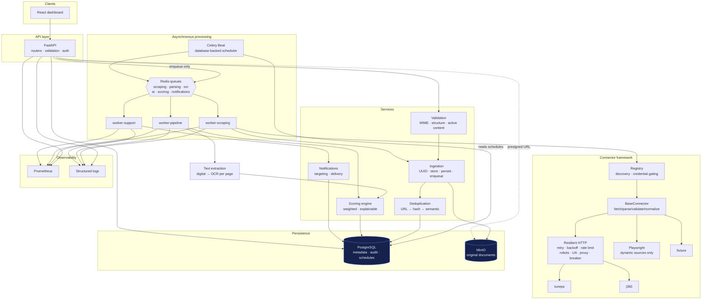
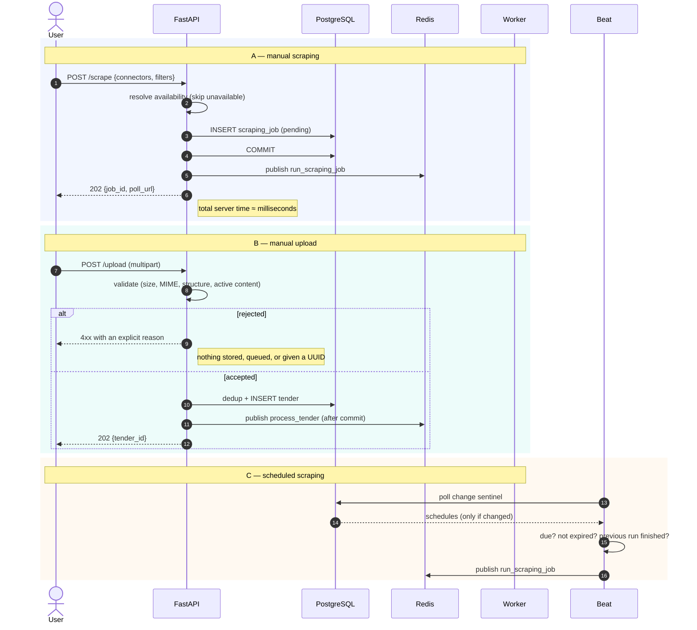
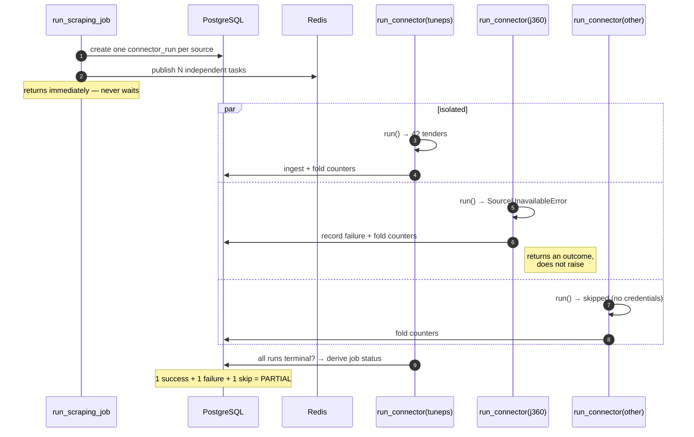
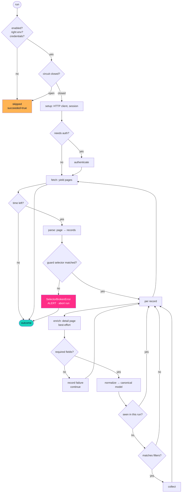
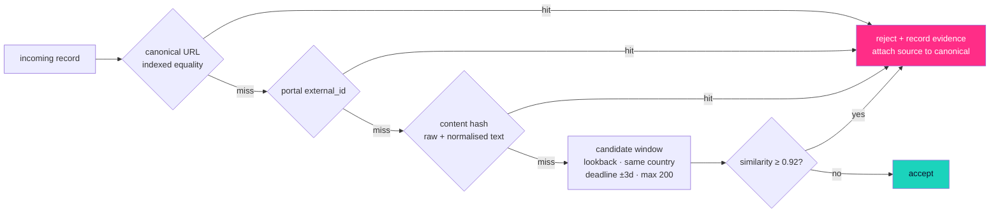
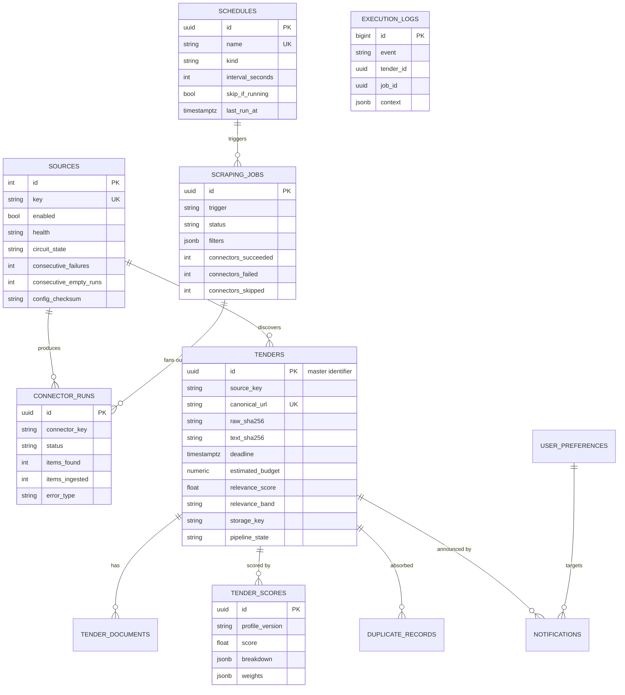
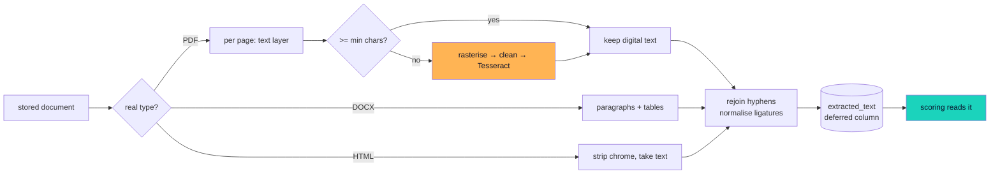

# Architecture

## Guiding principle

> **The pipeline must never block.**

Everything below is a consequence of that sentence. When a decision looks
unusual, it is almost always because the obvious alternative introduces a way
for one slow or broken thing to hold up everything else.

Three corollaries drive the concrete design:

1. **No request waits on work it does not have to.** Every heavy endpoint
   returns `202 Accepted` with a resource to poll.
2. **No failure propagates upward.** Failures are converted into recorded
   outcomes at the boundary where they occur.
3. **No wait is unbounded.** Every timeout, retry, page count and run has a
   ceiling.

---

## Component diagram



---

## The three entry points



**Why publishing happens after `COMMIT`:** Redis is faster than a PostgreSQL
commit. Publishing inside the transaction lets a worker start, query for the
row, and find nothing — intermittently, and only under load. `ingestion.py`
attaches the publish to SQLAlchemy's `after_commit` event for exactly this
reason.

---

## Connector fan-out — where isolation is enforced



There is deliberately **no chord** and no result-dependency between the tasks. A
chord's callback is skipped when any member fails, which would mean one broken
portal suppressing the results of every healthy one — precisely the coupling
this architecture exists to prevent. Aggregation happens in the database, so
the fan-out survives restarts, retries and partial failures.

---

## Inside one connector run



Note that **every terminal state is an outcome object**, including the failures.
`run()` has no path that raises.

---

## Duplicate detection — three stages, cheapest first



Ordering is the performance design, not an implementation detail. Stages 1 and
2 are single indexed lookups and resolve the large majority of records; stage 3
runs only on survivors, and only against a bounded candidate window. That keeps
duplicate detection **O(1) per record** even when 500 tenders arrive at once,
instead of O(n²) across the corpus.

A confirmed duplicate is rejected but never discarded: the evidence goes to
`duplicate_records` and the new source is attached to the canonical tender, so
the dashboard can say *"seen on 3 portals"* and an operator can always answer
*"why is this tender not showing up?"*.

---

## Data model



### The master UUID

`tenders.id` is a UUID4 minted at ingestion, and it is deliberately the *same*
value used as:

- the object key prefix in MinIO,
- the sole argument to every downstream Celery task,
- the correlation key in logs and in `execution_logs`,
- the idempotency token that makes a replayed task overwrite rather than
  duplicate.

That single identity is what makes at-least-once delivery (which a Redis broker
absolutely will produce) result in at-most-once effect.

### Two stores, one rule

**Bytes in MinIO, facts in PostgreSQL.** A 20 MB PDF in a database column
bloats every backup, defeats connection pooling and makes the table
unqueryable. Downloads are served as short-lived presigned URLs — the API never
proxies file bytes, because streaming a 25 MB file would occupy a request
worker for the whole transfer.

---

## Document understanding



Three decisions carry the value:

**The OCR fallback is per page, not per document.** Tender files are routinely
hybrid — a digital cover page followed by a scanned, stamped annex. Choosing one
strategy for the whole file either wastes ~1s/page on pages that did not need
it, or silently loses the pages that did.

**`extracted_text` is a deferred column.** It holds hundreds of kilobytes per
tender, and the dashboard's listing query selects whole `Tender` rows. Loading
it eagerly would turn a 200-row page into tens of megabytes on the wire.

**Extracted text feeds scoring but never deduplication.** `full_text` is
excluded from `comparison_text()`, because two unrelated tenders that attach the
same boilerplate annex would otherwise look identical.

Measured on one document in the running stack: **0.24 (low relevance) without
extracted text, 0.79 (highly relevant) with it.**

---

## Failure design

Every exception carries three attributes, and the retry policy reads them
instead of matching on messages:

| Attribute | Meaning | Consequence |
|---|---|---|
| `retryable` | may succeed if attempted again | exponential backoff with jitter |
| `alerting` | a human must look at it | raises an alert; does not retry blindly |
| `terminal` | definitively unusable | recorded and dropped, no alarm |

```
SmartTenderError
├── ConfigurationError            alerting, terminal
├── ConnectorError
│   ├── SourceUnavailableError    retryable
│   ├── RateLimitedError          retryable, honours Retry-After
│   ├── CircuitOpenError          alerting — skipped, not retried
│   ├── AuthenticationError       alerting, terminal — never retried
│   ├── CredentialsMissingError   terminal, NOT alerting (expected for J360)
│   ├── RobotsDisallowedError     terminal
│   ├── DownloadError             retryable
│   └── ParsingError
│       ├── SelectorBrokenError   alerting ← the highest-value alert
│       └── NormalizationError    terminal
├── ValidationError               terminal
│   ├── FileTooLargeError
│   ├── UnsupportedMediaTypeError
│   ├── CorruptedFileError
│   └── SuspiciousContentError    alerting
├── DuplicateTenderError          terminal, NOT alerting (high-volume normal)
├── StorageError                  retryable, alerting
├── NotificationError             retryable
└── ScoringError                  degrades to remaining criteria
```

Two of these deserve emphasis:

**`CredentialsMissingError` is not alerting.** Running without a J360
subscription is a normal configuration, not an incident. The source is skipped
quietly and every other connector runs.

**`SelectorBrokenError` is the alert that matters most.** It is the difference
between *"this portal published nothing today"* and *"we have been silently
blind to this portal for a week"*.

---

## Bounded waits

| Boundary | Mechanism |
|---|---|
| Single HTTP request | connect / read / write / pool timeouts |
| Request including retries | `total_seconds` budget, checked before each attempt |
| Retry backoff | exponential, capped, jittered ±25% |
| Attempts | `max_attempts` (default 4), then a typed failure |
| Repeatedly failing source | circuit breaker opens, calls refused without network |
| Pagination | `max_pages`, plus early stop on empty or already-seen pages |
| Connector run | `deadline_seconds`, stops cleanly and returns partial results |
| Celery task | soft limit (records its own failure) + hard limit (killed) |
| Database statement | `statement_timeout` |
| Rate limit sleep | capped per acquisition |
| Notification volume | per-user daily cap |

---

## Queue topology

Work is split by **resource profile**, not by feature, so classes of work with
different cost characteristics scale independently and cannot starve each
other.

| Queue | Profile | Why separate |
|---|---|---|
| `scraping` | network-bound, minutes, bursty | a slow portal must never occupy the workers that ingest uploads |
| `parsing` | CPU-bound, seconds | main throughput queue |
| `ocr` | very CPU/memory heavy | needs low concurrency; two concurrent jobs will swap a small box |
| `ai` | slow, rate-limited, retry-prone | isolates LLM/embedding latency |
| `scoring` | cheap and fast | a re-scoring sweep must not sit behind an hour of scraping |
| `notifications` | I/O-bound on SMTP | must stay responsive |
| `maintenance` | periodic housekeeping | lowest priority |

---

## Scheduling

Celery's stock scheduler reads a Python dict frozen at process start, so
changing a cadence means editing code and restarting Beat. `DatabaseScheduler`
treats the `schedules` table as the source of truth and polls a single-row
sentinel, reloading only when that timestamp moves — so "check for changes"
costs one trivial query per interval regardless of how many schedules exist,
and an edit made through the API takes effect within one interval.

Two production protections:

- **Expiry** — after downtime, Beat would otherwise fire every missed run at
  once. `expire_seconds` discards stale runs; a stampede of forty catch-up
  scrapes is worse than skipping them.
- **Overlap** — `skip_if_running` refuses to start a schedule whose previous job
  is still going, so a portal that got slow cannot accumulate concurrent runs.

---

## Self-healing

A distributed pipeline that only moves forward accumulates state nobody owns.
Four reconciliation loops repair it:

| Task | Cadence | Repairs |
|---|---|---|
| `reconcile_stuck_jobs` | 10 min | jobs whose worker died — otherwise `skip_if_running` blocks that schedule forever |
| `requeue_stalled_tenders` | 15 min | tenders committed but never enqueued (broker blip) |
| `flush_pending_notifications` | 10 min | notifications created during a broker outage |
| `check_connector_health` | hourly | sources that have gone silent or degraded |

---

## Security

| Concern | Control |
|---|---|
| Upload validation | extension + magic-byte MIME + agreement between them + structural integrity |
| Active content | PDF `/JavaScript` `/OpenAction` `/Launch` `/EmbeddedFile`; DOCX `vbaProject.bin`; HTML script/iframe/handlers |
| Zip bombs | uncompressed-size ratio check on DOCX |
| Path traversal | `sanitize_filename` strips both separator conventions; `safe_object_key` refuses `..` |
| SSRF | scraped links are checked against private/link-local ranges before fetching |
| Secrets | read from the environment at call time; never persisted, logged or echoed — `redact()` masks leaves recursively |
| Storage | encrypted at rest (SSE), private bucket, time-limited presigned URLs only |
| API | constant-time key comparison; production refuses to boot without keys |
| Transport | TLS verification always on; security headers on every response |

---

## Performance

Handling 500+ simultaneous arrivals rests on four properties:

1. **The request path does no heavy work** — ingestion is a dedup lookup, one
   object PUT and one INSERT.
2. **Duplicate detection is O(1) per record** — indexed equality first, bounded
   candidate window last.
3. **Fan-out is horizontal** — one task per connector, one task per tender,
   scaled by adding workers.
4. **Nothing serialises on a shared lock** — counters are incremented, not
   read-modify-written, and job status is derived rather than coordinated.
