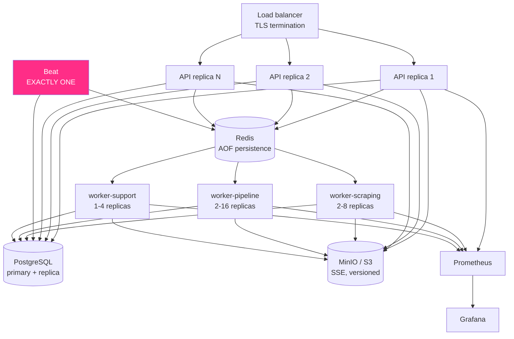

# Deployment guide

## Topology



> **Beat must be a singleton.** Two instances double-fire every schedule. Use
> `replicas: 1` with a `Recreate` strategy, never a rolling update.

---

## Sizing

Starting point for ~5 sources and a few thousand tenders per day:

| Component | Replicas | CPU | Memory | Scale when |
|---|---|---|---|---|
| API | 2–3 | 0.5 | 512 Mi | request latency rises |
| worker-scraping | 2 | 1 | 1 Gi | `queue_size{queue="scraping"}` grows |
| worker-pipeline | 2 | 1 | 1 Gi | `queue_size{queue="parsing"}` grows |
| worker-support | 1 | 0.5 | 512 Mi | notification backlog |
| Beat | **1** | 0.2 | 256 Mi | never |
| PostgreSQL | 1 + replica | 2 | 4 Gi | connection saturation |
| Redis | 1 | 0.5 | 1 Gi | memory pressure |
| MinIO | per policy | 1 | 2 Gi | storage growth |

Scale **per queue**, not uniformly. Backlogged parsing and backlogged scraping
have different causes and different fixes: parsing needs CPU, scraping is
usually blocked on portal politeness, where adding workers achieves nothing
because the Redis-backed rate limiter is shared.

---

## Pre-flight checklist

```bash
# Secrets — never the defaults
SMARTTENDER_API__API_KEYS=["<generated>"]     # startup FAILS if empty in production
SMARTTENDER_DB__PASSWORD=<generated>
SMARTTENDER_STORAGE__SECRET_KEY=<generated>
SMARTTENDER_REDIS__PASSWORD=<generated>

SMARTTENDER_ENV=production      # disables /docs, enables HSTS and strict startup
SMARTTENDER_LOG_FORMAT=json
SMARTTENDER_STORAGE__SECURE=true
SMARTTENDER_STORAGE__SERVER_SIDE_ENCRYPTION=true
```

> **Object storage encryption.** `SERVER_SIDE_ENCRYPTION` defaults to `true`
> (secure by default), and SSE-S3 requires the object store to have a **KMS
> configured**. Without one, MinIO rejects every write with `NotImplemented` —
> and because ingestion deliberately keeps the tender when archiving fails, the
> symptom is "documents are silently never stored". Configure KMS, or set it to
> `false` only where the volume itself is encrypted. The local Compose stack
> sets it to `false` because single-node MinIO has no KMS.

- [ ] Secrets from a secret manager, never a baked image or a committed `.env`
- [ ] Object storage KMS configured (or SSE consciously disabled — see above)
- [ ] TUNTRUST certificate PEM files mounted read-only, paths as seen *inside*
      the container
- [ ] `runtime-browser` image deployed for the worker that runs J360
- [ ] TLS terminated at the load balancer; API behind it with `--proxy-headers`
- [ ] `SMARTTENDER_API__CORS_ORIGINS` restricted to the real dashboard origin
- [ ] MinIO bucket **private**; downloads only through presigned URLs
- [ ] Backups configured **and a restore rehearsed**
- [ ] Prometheus scraping `/metrics`; `deploy/alerts.yml` loaded
- [ ] Log shipping configured (JSON, so `tender_id` is a queryable field)
- [ ] Exactly one Beat replica
- [ ] Migrations run as a pre-deploy job, not on container start

---

## Deploying

### Migrations first, as a separate job

```bash
alembic upgrade head
```

Never on container start: N replicas starting together would run it N times
concurrently. Compose models this with a one-shot `migrate` service that the
others `depend_on` with `service_completed_successfully`.

Keep migrations backward compatible so old and new code can run together during
a rolling deploy: add nullable columns first, backfill, and only tighten
constraints in a later release.

### Rolling update

Workers use `acks_late`, so a task interrupted by a shutdown returns to the
queue and is replayed — safe because every task is idempotent by UUID. Give
them a termination grace period longer than the longest task:

```yaml
terminationGracePeriodSeconds: 2100   # > scraping hard limit
```

### Health probes

```yaml
livenessProbe:
  httpGet: { path: /health/live, port: 8000 }
  initialDelaySeconds: 20
  periodSeconds: 30
readinessProbe:
  httpGet: { path: /health/ready, port: 8000 }
  periodSeconds: 10
```

Do not point liveness at `/health/ready`. A readiness-style liveness probe
restarts every healthy API pod during a database incident, converting a
degradation into a full outage.

---

## Observability

### Metrics that matter

| Metric | Watch for |
|---|---|
| `queue_size` | the best saturation signal — rising means arrivals exceed processing |
| `scraper_failure_total` / `scraper_success_total` | per-source failure ratio |
| `scraper_items_found_total` | **zero while runs succeed** = broken selector |
| `parsing_failures_total{error_type="SelectorBrokenError"}` | portal markup changed |
| `circuit_breaker_state` | `2` = a source is being skipped |
| `duplicate_ratio` | near 1.0 = incremental pagination stopped working |
| `connector_duration_seconds` | a source getting slower before it fails |
| `tenders_ingested_total` | business throughput |
| `stage_duration_seconds{stage="ingest"}` | should be milliseconds; seconds means the request path is doing work it shouldn't |

`deploy/alerts.yml` ships rules for all of these. The alerting philosophy: page
on **symptoms a user would notice** and on **silence**, not on individual
errors. A single failed request is noise; a source that has stopped producing
tenders is a business problem.

### Logs

JSON in production, one event per line, with `tender_id`, `job_id`, `connector`
and `request_id` attached automatically. Take any tender UUID and reconstruct
its complete journey:

```
tender_uuid:"9c1d..." | sort by timestamp
```

Credentials, tokens, cookies and secret query parameters are masked before a
line is emitted.

---

## Backups

| What | How | Frequency | RPO |
|---|---|---|---|
| PostgreSQL | `pg_dump` + WAL archiving | daily full, continuous WAL | minutes |
| MinIO | bucket replication or versioning | continuous | minutes |
| Redis | AOF | continuous | seconds |
| `config/` | in version control | per change | — |

Redis holds queued work, not durable state — losing it costs in-flight tasks,
which the reconciliation loops re-queue. PostgreSQL and MinIO are the real
crown jewels.

```bash
pg_dump -Fc -h $HOST -U smarttender smarttender > backup-$(date +%F).dump
```

**Rehearse the restore.** An untested backup is a hypothesis.

---

## Security

| Layer | Control |
|---|---|
| Network | API is the only public surface; PostgreSQL/Redis/MinIO on a private network |
| Transport | TLS at the load balancer; outbound TLS verification always on |
| Authentication | API keys compared in constant time; production refuses to boot without them |
| Uploads | extension + magic bytes + agreement + structure + active-content scan |
| SSRF | scraped links checked against private and link-local ranges before fetching |
| Storage | private bucket, SSE at rest, time-limited presigned URLs only |
| Secrets | environment-only, read at call time, never persisted or logged |
| Container | non-root user, no compilers in the runtime image, `tini` as PID 1 |
| Headers | `nosniff`, `DENY`, `no-referrer`, CSP, HSTS in production |

---

## Runbook

**A source stopped producing tenders**

```bash
curl -s -H "X-API-Key: ..." localhost:8000/sources/<key>          # health + last error
smarttender-admin dry-run <key> --pages 1                          # reproduce, write nothing
```

`SelectorBrokenError` → fix `config/connectors/<key>.yaml`, then
`POST /sources/sync`. No rebuild, no restart.

**A queue is backing up**

```bash
curl -s localhost:8000/metrics | grep queue_size
docker compose up -d --scale worker-pipeline=6
```

If it is `scraping`, check whether the rate limit is the real constraint —
adding workers will not help, since the bucket is shared.

**A circuit is open**

Expected while a portal is down; it protects both sides. After confirming
recovery:

```bash
curl -X POST -H "X-API-Key: ..." localhost:8000/sources/<key>/reset-circuit
```

**A tender is missing from the dashboard**

```bash
curl -s -H "X-API-Key: ..." "localhost:8000/admin/duplicates?page_size=50"
curl -s -H "X-API-Key: ..." "localhost:8000/admin/logs?connector=tuneps&level=WARNING"
```

Usually a correctly-detected duplicate, or an `out_of_scope` veto from a
blocking keyword.

**Schedules stopped firing**

Check exactly one Beat pod is running and that the previous job is not still
`running` (`skip_if_running`). `reconcile_stuck_jobs` clears jobs abandoned by a
dead worker within 10 minutes.

**Redis was lost**

Queued tasks are gone; committed tenders are not. `requeue_stalled_tenders` and
`flush_pending_notifications` recover the pipeline within ~15 minutes. Circuit
and rate-limit state rebuild themselves.
