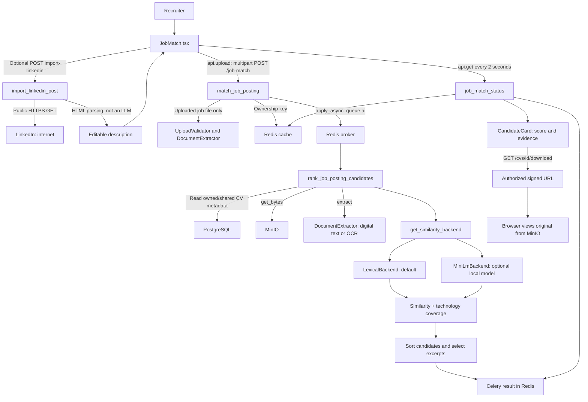

# Job matching: AI, algorithms, libraries and demo

Date: 2026-09-23. This guide describes the code in this repository, not a proposed AI architecture. For more detail, see the [HLD](HLD.md), [LLD](LLD.md) and [architecture overview](ARCHITECTURE.md).

Update: local [evidence-based filters](FILTERS.md) now evaluate age, experience, languages, certifications and education. This supersedes the inactive-filter descriptions below. No LLM or paid tokens were added. The offline scoring-only demo remains valid; full searches now prioritize confirmed criteria before similarity score.

## 1. Summary: does job matching use an LLM?

**The current job-matching path does not call an LLM.** Its configured/default backend is `lexical`, a deterministic local similarity algorithm. It does not send the job description or CVs to OpenAI, Mistral, LinkedIn or another model provider for ranking. There are no external model API tokens billed for this path.

There are two places where trained models can participate:

- **Optional MiniLM embeddings:** a local neural text encoder, selected only when `minilm` is configured and its dependencies/model files load successfully. It produces vectors, not generated answers.
- **OCR:** scanned PDF pages can be read by the local Tesseract engine using installed language data. OCR turns document images into text; it does not decide candidate suitability.

The repository's Compose/environment examples mention Mistral and Qdrant. Those references do **not** mean this task calls them. The actual ranking task calls `get_similarity_backend()`, file extraction, object storage and the database. Its displayed explanations are calculated fields and copied excerpts, not LLM-generated opinions.

The inspected local environment files specify `lexical`. A running process can still have different environment overrides; use `candidate.explanation.method` in a fresh search result to identify the backend that actually ran. The top-level `weights.version` is hard-coded and is not reliable for this purpose.

## 2. Local execution, internet and tokens

| Operation | Where it runs | Internet during execution? | External AI tokens? |
|---|---|---|---|
| React interface | User's browser | Only connection to the deployed app | No |
| Job API and worker | Local Docker containers in the default deployment | Internal service traffic | No |
| CV storage/database | MinIO/PostgreSQL containers | Internal network; PDF retrieval from browser | No |
| Lexical similarity | Python in `worker-ai` | No | No |
| MiniLM, if enabled | ONNX Runtime on worker CPU | No, with required files installed locally | No |
| PDF/DOCX text extraction | API for job files; worker for CV files | No | No |
| Scanned PDF OCR | Local Tesseract process | No, with language data installed | No |
| LinkedIn job/post import | API requests a public LinkedIn page | **Yes** | No model API tokens |
| Build/install | Docker registry and package/model sources | Usually yes | Package/model downloads are not inference token calls |

"Local" means the machine hosting these services. If deployed on a remote server, computation happens on that server rather than the recruiter's laptop. HTTP between containers is network communication, but it is not a paid external AI call.

### Three meanings of token

1. **Lexical word token:** a normalized word used as a mathematical feature. No billing.
2. **MiniLM tokenizer token:** a model input unit/subword. The implementation defaults to a maximum sequence length of 256 tokens. This is a processing limit, not a purchased quota.
3. **API credential or signed URL:** access credentials for SmartTender/storage. These are unrelated to model token billing.

There is no prompt, completion, temperature, API token budget or LLM-generated answer in the current matching flow. CPU, memory, storage and any hosting costs still exist.

## 3. Architecture: who calls whom?



No Qdrant retrieval or cloud LLM call appears in this diagram because neither is executed by this feature.

### Concrete call chain

| Step | Code call | Purpose |
|---|---|---|
| 1 | `JobMatch.submit()` → `api.upload('/job-match', form)` | Send description, criteria and `background=true` |
| 2 | `match_job_posting()` | Validate input; extract an uploaded job file in a thread |
| 3 | `_owners().setex(...)` | Associate task UUID with caller for 1 hour |
| 4 | `rank_job_posting_candidates.apply_async(..., queue='ai')` | Publish task; return UUID to UI |
| 5 | `session_scope()` and SQLAlchemy query | Load CVs owned by caller or with null owner |
| 6 | `get_storage().get_bytes(key)` | Read each original document |
| 7 | `get_extractor().extract(...)` | Obtain CV text |
| 8 | `get_similarity_backend().similarity(job_text, cv_text)` | Calculate text similarity |
| 9 | Normalized substring comparisons | Find selected technologies in the CV |
| 10 | Weighted score, sorting, excerpt selection | Build result and explanation payload |
| 11 | `job_match_status()` → `celery_app.AsyncResult(task_id)` | Return queued/running/completed result |
| 12 | `CandidateCard.viewCv()` → CV download route | Obtain a temporary file URL |

The legacy synchronous API path still waits at most 90 seconds. The frontend uses background polling because document processing can take minutes. It checks every two seconds, with a 20-minute UI deadline and a 120-second timeout per API request. The worker defaults to 600/900-second soft/hard task limits. These limits serve different purposes and do not cancel one another automatically.

## 4. Libraries and their roles

These are the declared packages and code paths; package minimum versions are not a lock of the versions installed on every machine.

| Library / technology | Type | Role in this feature |
|---|---|---|
| React, TypeScript, Vite | Frontend framework/language/build tool | Search screen, state, result cards, PDF iframe |
| FastAPI, Pydantic, python-multipart | HTTP API and validation | Routes, typed inputs, multipart forms |
| AnyIO | Concurrency library | Run blocking extraction/storage work in threads; import timeout scope |
| Celery | Distributed task library | Execute long-running ranking outside the API request |
| Redis | Broker/result/cache service | Queue, results, ownership keys |
| SQLAlchemy, psycopg/asyncpg | ORM and database drivers | PostgreSQL CV metadata access |
| minio Python client | Object-storage client | Original CV bytes and signed links |
| pypdf | PDF parser | Read a digital PDF text layer |
| python-docx | Office document parser | Read DOCX paragraphs and tables |
| pypdfium2 | PDF rendering wrapper | Rasterize scanned PDF pages for OCR |
| Pillow, NumPy | Image/array libraries | Image and numerical processing |
| OpenCV (`opencv-python-headless`) | Computer vision library | Grayscale preprocessing, median blur, adaptive thresholding |
| pytesseract + Tesseract | Python wrapper + OCR engine | Recognize characters from page images |
| `math`, `Counter`, `unicodedata`, `re`, `lru_cache` | Python standard library | Default normalization, lexical features, vector scoring and cache |
| onnxruntime | Optional neural inference runtime | Load MiniLM ONNX model on CPU |
| tokenizers | Optional tokenizer library | Convert normalized text into MiniLM input IDs/masks |
| httpx | HTTP client | Retrieve public LinkedIn HTML |
| BeautifulSoup | HTML parser | Extract LinkedIn job/post text without text generation |

The lexical computation itself is standard-library Python. The complete application still needs its API, database and task libraries.

## 5. Algorithm: document extraction and OCR

### Digital PDF

The extractor first uses `pypdf` to read embedded text. It determines which pages contain too little readable text. Digital text is cheaper than OCR, so readable pages do not need image recognition.

### Scanned PDF

For pages needing OCR, and within the configured OCR page budget:

```text
PDF page
  -> pypdfium2 rasterization
  -> Pillow image
  -> grayscale
  -> OpenCV median blur (3-pixel kernel)
  -> adaptive Gaussian thresholding (block size 31, constant 10)
  -> Tesseract through pytesseract
  -> recognized text
```

Median blur reduces image noise; adaptive thresholding separates foreground text from varying page backgrounds. If preprocessing is unavailable, the code can fall back to the original image. OCR availability and installed language data determine what can be recognized. This does not guarantee accurate reading of every layout or scan.

### DOCX

`python-docx` reads nonempty paragraphs and table cells. The extractor cleans and limits the resulting text. It does not use a language model to infer missing content.

The ranking task rereads and re-extracts each CV on every search. It does not currently persist extracted text, explaining much of the latency for scanned collections. On a per-CV read/extraction exception it logs a warning and continues with empty text.

## 6. Algorithm: normalization

`normalize_text()` applies Unicode normalization, removes accents, lowercases text, replaces punctuation with spaces and collapses whitespace. Digits are preserved by default.

```text
"Développeur PYTHON, SQL !" -> "developpeur python sql"
```

This reduces differences caused by casing and typography. It is not translation, stemming, skill extraction or synonym resolution. Punctuation-heavy technologies such as `.NET` and `C++` can lose meaningful distinctions.

## 7. Algorithm: lexical similarity (current default)

### A. Word features

Normalize and split text. Remove common French/English stopwords and tokens of length at most two. Create features such as `w:python` and `w:developer`. Each occurrence contributes **0.65** to the initial feature count.

Consequences: words such as `SQL` remain; two-character terms such as `AI` are omitted from the word-feature branch, though their characters may contribute to the character-feature branch.

### B. Character 4-grams

Replace normalized spaces with underscores, then slide a four-character window through the text:

```text
"python" -> "pyth", "ytho", "thon"
```

Each occurrence contributes **0.35** to its `g:` feature. This can preserve partial overlap despite spelling differences; it does not provide semantic understanding.

### C. Feature weighting and normalization

The exact implementation is:

```text
For each feature f with initial weighted count c_f > 0:
    w_f = 1 + ln(c_f)

L2 norm = sqrt(sum(w_f²))
v_f = w_f / L2 norm
```

Repeated terms grow logarithmically. This is **not TF-IDF**: no inverse-document-frequency statistic is calculated from the corpus. The 0.65/0.35 constants affect counts before the logarithm; they are not guaranteed final percentages of the cosine score. In particular, a character feature occurring once has `1 + ln(0.35)`, which is slightly negative; this guide reports the implemented formula without replacing it with a textbook alternative.

### D. Cosine similarity

Both vectors are normalized, so their dot product gives cosine similarity:

```text
T = clamp(sum(v_job[f] × v_cv[f]), 0, 1)
```

The implementation returns zero for empty inputs and one for identical nonempty strings. Encodings are cached in process using an LRU cache, default size 4,096. This is a vector-computation cache, not a persistent CV text cache.

## 8. Optional algorithm/model: all-MiniLM-L6-v2

This is the model name expected by the `MiniLmBackend` implementation. It is a sentence-embedding encoder, not a chat/completion LLM. The code loads local files; it does not download or train a model during a search.

Expected files:

```text
models/all-MiniLM-L6-v2/
  model.onnx
  tokenizer.json
```

Processing:

1. Normalize the text with the same normalization utility.
2. Tokenize using the local `tokenizer.json`; truncate to the configured maximum, default **256 tokens**.
3. Create NumPy arrays for input IDs and attention masks; add zero token-type IDs if the model requires them.
4. Run `onnxruntime.InferenceSession` with `CPUExecutionProvider`; the implementation sets one intra-operation thread.
5. Read token-level hidden states from the first model output.
6. Compute attention-mask-weighted mean pooling so padding does not contribute.
7. Apply L2 normalization and compare job/CV vectors by dot product, clamped to `[0,1]`.

```text
embedding = L2_normalize(sum(hidden_i × mask_i) / sum(mask_i))
similarity = clamp(dot(embedding_job, embedding_cv), 0, 1)
```

This requires an ONNX export whose input/output shapes match that code. Merely naming a directory after the model does not validate its contents.

### Selection and fallback

`get_similarity_backend()` reads `settings.semantic.backend`. For `minilm`, it constructs the encoder and encodes `warmup`. If imports, files or initial inference fail, it logs the failure and chooses lexical. The backend is cached per process. Later inference errors are not wrapped by this initialization fallback.

The optional package extra is `.[semantic]` (`onnxruntime`, `tokenizers`, `numpy`). The current Dockerfile installs the base package, not that extra. Enabling MiniLM therefore needs the extra installed in the worker image, valid files mounted at the configured location, and the setting explicitly passed to the worker. Changing only the root `.env` is insufficient unless Compose forwards that variable; the current shared Compose environment does not explicitly forward semantic selection.

```text
SMARTTENDER_SEMANTIC__BACKEND=minilm
SMARTTENDER_SEMANTIC__MODEL_PATH=/app/models/all-MiniLM-L6-v2
```

These are configuration references, not changes made by this documentation task. No MiniLM model was installed or benchmarked for the demo below. The model-file path defaults to `./models/all-MiniLM-L6-v2` in code.

### Limitations

The whole-document scoring call truncates each input to 256 tokenizer tokens by default. Relevant content later in a long CV may therefore be excluded from that score. The separate evidence stage scores shorter chunks, but it does not replace the whole-document score with chunk aggregation. Multilingual or domain-specific quality needs evaluation; the presence of a neural encoder alone does not prove good matching quality.

## 9. Algorithm: technology coverage and final ranking

The recruiter selects technologies explicitly. For each requested entry, normalize it and check whether it appears as a substring in normalized CV text.

```text
coverage C = matched technology entries / requested technology entries

If no technologies were selected:
    final score S = text similarity T
Otherwise:
    S = 0.75 × T + 0.25 × C
```

The **75/25** weighting belongs to final candidate ranking. It is different from the **65/35** feature-count weighting inside the lexical algorithm.

All eligible candidates are scored and sorted in descending order. The default response includes the top 20. Selection is restricted to rows whose `uploaded_by` equals the caller's identity or is null (shared). A high score means relatively strong textual overlap/coverage in that corpus, not verified competence.

Substring matching has limitations: `Java` may match text containing `JavaScript`; synonyms are not resolved; duplicate requested entries are not removed. The other filter fields—age, experience, qualifications, certifications and languages—are currently accepted but not evaluated. They must not be presented as checked requirements.

## 10. Algorithm: evidence and explanations

For each returned candidate:

1. Split the extracted CV into consecutive, non-overlapping chunks of 70 words.
2. Compare every chunk with the job description using the selected similarity backend.
3. Sort chunks by similarity and return up to three.
4. Return rank, total eligible candidates, text score, weights, technology coverage and text availability.

The text shown as evidence is copied from the CV. It is not generated or rewritten by an LLM. Excerpt scores are explanatory comparisons, not extra terms in the final score. There are no PDF page coordinates or highlighted matched locations. The PDF viewer displays the original document through a signed storage URL.

## 11. LinkedIn: parsing, not AI

The API accepts specific HTTPS LinkedIn job/post URL patterns, normalizes the destination to `www.linkedin.com`, and fetches public HTML with redirects disabled. It extracts a JSON-LD `JobPosting` description or supported post-content elements with BeautifulSoup. It returns editable text to the recruiter.

Limits: 2 MiB response body, 50,000 extracted characters, 15-second HTTP timeout and a route-level 20-second cancellation scope. Login-required, blocked, redirected or unrecognized pages fall back to asking the user to paste text. No LinkedIn login or private profile search is performed, and CV data is not sent to LinkedIn by this import.

## 12. Executed offline algorithm demo

The companion [demo_algorithms.py](demo_algorithms.py) uses the repository's actual `LexicalBackend` and normalization function with three synthetic CV texts. It reproduces the current technology-weighted formula. It does not use private CVs or write to the database.

It was executed successfully in a temporary container with `--network none`. Project services were not started by this demo. This verifies the offline scoring path; it is not an end-to-end UI/OCR/Celery test.

### Inputs

Job description:

> Python developer building REST APIs with SQL and Docker.

Selected technologies: **Python, SQL, Docker**.

| Synthetic profile | CV text |
|---|---|
| A — Backend developer | Python developer building REST APIs with SQL and Docker. Developed backend services and automated tests. |
| B — Data analyst | Data analyst using Python and SQL for reports, dashboards and data cleaning. |
| C — Graphic designer | Graphic designer creating logos and illustrations with Photoshop and Illustrator. |

### Actual output

| Rank | Candidate | Text similarity T | Coverage C | Final score S | Missing technologies |
|---|---|---:|---:|---:|---|
| 1 | A — Backend developer | 0.5034 | 1.0000 | **0.6275** | None |
| 2 | B — Data analyst | 0.1637 | 0.6667 | **0.2895** | Docker |
| 3 | C — Graphic designer | 0.0000 | 0.0000 | **0.0000** | Python, SQL, Docker |

Scores use unrounded components internally, then are rounded for output. Rounded table components can produce small last-digit differences if recalculated manually. The current UI's main score rounds to whole percentages: approximately **63%, 29%, 0%**.

Profile A wins because its text most closely resembles the description and it contains all three requested technologies. Profile B gets partial coverage. Profile C is still returned with zero: there is currently no minimum-score rejection threshold.

### Reproduce

With the backend installed in your Python environment, from the repository root:

```powershell
python docs/job-matching/demo_algorithms.py
```

Alternatively, with Docker available and the existing application image built:

```powershell
docker run --rm --network none --entrypoint python `
  -v "${PWD}/docs/job-matching:/demo:ro" `
  smarttender/ingestion:local /demo/demo_algorithms.py
```

The Docker form uses the algorithm packaged in that image; rebuild the image after changing `similarity.py` if you want it to reflect new code. No new dependencies or model downloads occur in this command.

## 13. Manual presentation demo: full capability walkthrough

This is a repeatable demonstration script for the running application, not a claim that a fresh browser session was run during this documentation task.

1. Create three small synthetic PDF/DOCX CV files containing the texts above, using a document editor. Do not upload a CSV as a CV.
2. Import those files in the CV import screen. For results limited to this demo, use an isolated demo environment/corpus; existing accessible CVs can change ranking.
3. Open `/job-match`, paste the sample description, and select Python, SQL and Docker.
4. Click **Rechercher les meilleurs profils** once. Explain that the request queues a Celery job while the UI polls; scanned documents can take longer.
5. Show each score, rank and found/missing technologies. Explain that the score is a comparison index, not a probability of hiring success.
6. Expand the evidence and show that the passages come from the stored CV.
7. Select **Voir le CV original** to preview the PDF; demonstrate the separate open/download link. DOCX files are downloadable.
8. Run a second search without technologies: the score then uses text similarity only.
9. Demonstrate **Lien LinkedIn** with a publicly accessible job/post. Review imported text before searching. If blocked, use **Coller le texte** and explain the public-access limitation.
10. Point out that age, experience, education, certifications and language fields do not yet enforce requirements.

PDF extraction can introduce line breaks or text differences, so exact UI scores need not equal the pure-text algorithm demo. Imported corpus size, active backend, OCR quality and text normalization also affect results.

## 14. Capabilities, limits and next improvements

| Supported now | Not implemented in this path |
|---|---|
| Compare previously imported CVs | Search LinkedIn for candidates |
| Local lexical ranking | Paid LLM evaluation or generated reasoning |
| Optional local MiniLM encoder | Automatic model download/training |
| Digital extraction and local OCR fallback | Persistent extraction cache |
| Technology-weighted score | Reliable evaluation of all displayed filter fields |
| Background execution and polling | Durable search history/resume/cancellation |
| Ranked excerpts and original PDF viewing | Highlighted PDF spans or page-linked evidence |
| Public LinkedIn job text import | Private/login-protected LinkedIn import |

Useful future work: cache extracted text; validate and apply supported criteria explicitly; improve technology boundary/synonym handling; stabilize ties; add labeled evaluation data and precision-at-k measures; then compare lexical versus embedding approaches on the same dataset. These are proposals, not current capabilities.

## 15. Source references

- [Ranking task](../../backend/app/workers/tasks/job_match.py)
- [Similarity algorithms and model loading](../../backend/app/services/similarity.py)
- [Text normalization](../../backend/app/core/identity.py)
- [Extraction and OCR](../../backend/app/services/extraction.py)
- [LinkedIn parsing](../../backend/app/services/linkedin_post.py)
- [API orchestration](../../backend/app/api/routers/job_match.py)
- [CV access](../../backend/app/api/routers/cvs.py)
- [UI and result explanations](../../frontend/src/pages/JobMatch.tsx)
- [Configuration defaults](../../backend/app/core/config.py)
- [Declared Python libraries](../../backend/pyproject.toml)
- [Container build](../../backend/Dockerfile) and [Compose deployment](../../docker-compose.yml)
