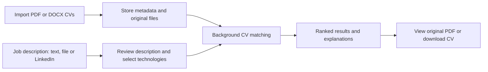

# Job matching architecture

Documentation date: 2026-09-23. Scope: the implementation currently in this repository.

## Documents

- [Evidence-based filters](FILTERS.md): current experience, language, certification and education checks and their limits.
- [AI, algorithms, libraries and demo](AI_ALGORITHMS_AND_DEMO.md): local versus internet execution, model/token explanation, exact algorithms and an executed synthetic demo.
- [High-level design (HLD)](HLD.md): components, deployment, data flows, boundaries, and design decisions.
- [Low-level design (LLD)](LLD.md): endpoints, data structures, algorithms, sequence diagrams, errors, and tests.

## Purpose

SmartTender compares a recruiter's job description with previously imported CVs. The recruiter can paste text, upload a job-description file, or import a publicly accessible LinkedIn job/post and review its text. Results show ranked candidates, score explanations, relevant excerpts, and access to the original CV.



## What exists today

| Capability | Current behavior |
|---|---|
| Candidate source | CV files already imported into this platform; no online candidate search |
| CV import UI | PDF and DOCX; CSV dataset import is not implemented |
| Job-description input | Pasted text, uploaded file, or public LinkedIn import |
| Search execution | Celery task on the `ai` queue; frontend polls for completion |
| Default scoring | Local lexical text similarity; optional MiniLM backend with lexical fallback |
| Technology criteria | User-selected technologies contribute to the score |
| Qualification filters | Evidence-based experience, language, certification and education checks; age checks use explicit age or a complete birth date |
| Explanation | Rank, corpus size, component scores/weights, found/missing technologies, excerpts |
| Original document | Temporary signed storage link; PDF iframe or DOCX download |
| Vector database / LLM | Neither Qdrant nor Mistral is used by this job-matching task |
| Durable search history | Not implemented; task results and ownership expire in Redis |

## Main implementation references

| Responsibility | Source |
|---|---|
| Search UI and result cards | [JobMatch.tsx](../../frontend/src/pages/JobMatch.tsx) |
| CV import UI | [ImportCvs.tsx](../../frontend/src/pages/ImportCvs.tsx) |
| Frontend API client | [client.ts](../../frontend/src/api/client.ts) |
| Result contracts | [jobMatchTypes.ts](../../frontend/src/api/jobMatchTypes.ts) |
| Search and polling endpoints | [job_match.py](../../backend/app/api/routers/job_match.py) |
| CV import, listing, download and deletion | [cvs.py](../../backend/app/api/routers/cvs.py) |
| Ranking task | [job_match.py](../../backend/app/workers/tasks/job_match.py) |
| LinkedIn import | [linkedin_post.py](../../backend/app/services/linkedin_post.py) |
| Text extraction and OCR | [extraction.py](../../backend/app/services/extraction.py) |
| Similarity implementations | [similarity.py](../../backend/app/services/similarity.py) |
| Storage and signed URLs | [storage.py](../../backend/app/services/storage.py) |
| CV database model | [cv.py](../../backend/app/db/models/cv.py) |
| Runtime deployment | [docker-compose.yml](../../docker-compose.yml) |

## Reading the scores

The score is a comparison measure, not a probability that someone is qualified or will succeed. Rank 1 means the highest computed score within the accessible imported corpus. It does not mean all job requirements have been validated. See the [LLD scoring specification](LLD.md#scoring-and-evidence) for the exact formula and limitations.

## Local operation

From the repository root:

```powershell
# Start existing containers
docker compose start

# Build and apply changes affecting matching
docker compose build api frontend
docker compose up -d --no-deps api frontend worker-ai

# Inspect matching activity
docker compose logs --tail 100 api worker-ai

# Stop without removing stored data
docker compose stop
```

Open `http://localhost:3000/job-match`. Refresh the browser after a frontend update and submit a new search after a ranking change. Old completed task results retain their original payload.

The `--no-deps` update assumes PostgreSQL, Redis and MinIO are already running. Do not use `docker compose down -v` to stop the project: it removes persistent volumes.

## Proposed next steps (not implemented)

1. Extract and cache CV text during ingestion, keyed by document hash and extractor version.
2. Store durable search records, progress, cancellation and resumable results.
3. Extend qualification parsing and add explicit job-requirement extraction beyond the user-selected filters.
4. Add dedicated user authentication and consistent ownership checks across all CV operations.
5. Evaluate ranking quality against labeled examples before adding vector retrieval or more complex scoring.

These are future work, not dependencies of the current feature.
