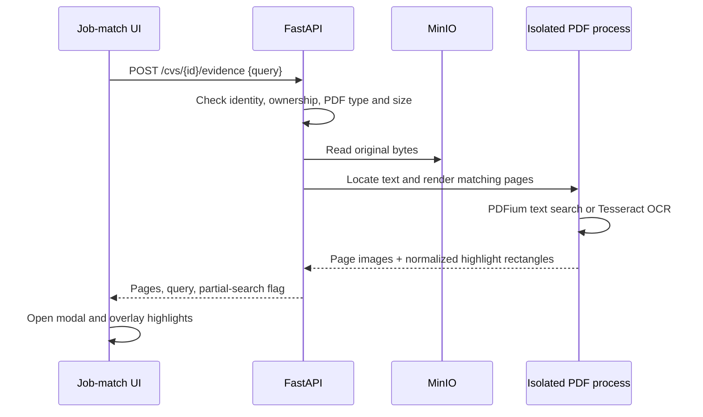

# Candidate comparison and PDF evidence

The job-match page requests all ranked CVs (`limit=0`) and displays unverified
and nonconforming profiles by default. Ranking first groups profiles by filter
status (pass, unknown, fail), then by the proportion of requested filter checks
confirmed, then by matching score. The matching score has no pass threshold:
all selected filter checks must pass for the overall filter status to pass.
An absent fact remains unknown; without selected filters there is nothing to
verify. Each card shows confirmed, unknown and failed criterion counts separately
from its text/technology matching score. Technologies contribute to that matching
score; they are not part of the structured filter-confirmation count.

Select 2–4 candidates in job-match results, then choose **Comparer**. The table
shows the existing matching score, requested skills found, experience, education,
languages, certifications, unmet or unverified requirements, and source excerpts.
Missing information is not treated as a confirmed mismatch. Selection resets on
a new search; selected candidates remain selected when the visibility filter changes.
On narrow screens, scroll inside the comparison table.

Click a matched skill (or a comparison excerpt) to locate it in the PDF. The
viewer displays the original page as an image with transparent highlights. It
does not modify the stored PDF or change candidate scores.

## Request flow



Comparison uses existing matching results locally in the browser. Evidence search
uses local PDFium and Tesseract, without LLM calls or internet token charges.
OCR text can contain errors and is labelled for verification. A matched skill in
the ranking may have no exact PDF location; the viewer reports that explicitly.
DOCX documents remain available through the original-document viewer but cannot
be highlighted by this endpoint.

## Bounds and implementation

- Maximum PDF size: 30 MiB; query: 1–600 characters.
- Examine up to 30 PDF pages and OCR up to 5 scanned pages, 4 seconds per OCR call.
- Return up to 3 matching pages, rendered with longest edge at most 1600 pixels.
- Overall rendering deadline: 45 seconds; at most 2 rendering processes concurrently.
- PDF coordinates are converted using PDFium, including intrinsic page rotation.
- Partial searches are labelled. No match does not prove the skill is absent.
- PDFium runs in isolated processes to avoid concurrent native-library calls.

Tests cover page selection, all four page rotations, no-match behavior, OCR box
mapping, ownership checks, unsupported files and the real API rendering process.

Rebuild and restart after changing the implementation:

```powershell
docker compose build api frontend
docker compose up -d --no-deps api frontend
```
