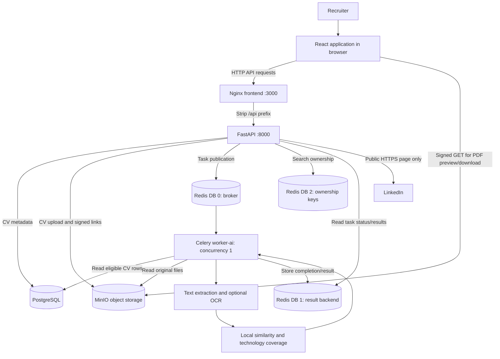

# Job matching: high-level design (HLD)

Status: implemented architecture as of 2026-09-23. See [architecture index](ARCHITECTURE.md) and [LLD](LLD.md).

Update: [Evidence-based filters](FILTERS.md) documents the implemented qualification checks and supersedes earlier descriptions below that call experience, language, education or certification filters inactive. Age checks now use an explicit age or complete birth date; see FILTERS.md. Confirmed profiles now precede unverified/insufficient profiles; similarity ranks within each group.

## Objective and scope

Help a recruiter find relevant profiles in an existing CV collection, understand the comparison, and inspect the original document. This design covers CV ingestion, job-description input, background ranking, result retrieval and CV viewing. Tender scraping, notifications and proposal generation are outside this feature's execution path.

## System context and components

Redis database numbers are configuration defaults. The broker, result backend and ownership store are logical databases on the Redis service, not three separate containers.

| Component | Responsibility |
|---|---|
| React / TypeScript | Collect input, import/review LinkedIn text, submit searches, poll, display scores and CVs |
| Nginx | Serve the static UI and proxy `/api/*` to FastAPI |
| FastAPI | Validate input, resolve caller identity, handle file storage, dispatch ranking, authorize polling/downloads |
| PostgreSQL | Store CV identity, metadata, ownership and storage references |
| MinIO | Store original documents privately and serve temporary signed GET requests |
| Redis / Celery | Queue searches, track state, retain results and temporary ownership mappings |
| `worker-ai` | Extract CV text, compare all eligible CVs, build explanations and rank results |
| LinkedIn | Optional source of a publicly readable job/post; no account connection |

Qdrant and other workers exist in the wider Compose stack but are not called by this ranking implementation. The default backend needs no embedding model or LLM API key.

## Main workflows

### 1. Import candidate CVs

The browser uploads a document to FastAPI. The API validates the bytes, writes the original file to MinIO, and creates a `cvs` row in PostgreSQL. Import does not currently pre-extract or persist text. A link-based CV import in the existing CV screen is fetched by the browser before upload; it is separate from server-side LinkedIn job import.

### 2. Prepare a job description

The recruiter either pastes text, uploads a file, or imports a LinkedIn URL. LinkedIn import returns editable text and switches the screen to text mode. For an uploaded job file, the API validates and extracts text before submitting the background ranking task. This preparation stage still occupies the original request.

### 3. Search and retrieve results

The API records task ownership and queues the search. It returns a task ID immediately after dispatch. The UI polls every two seconds; the worker reads each eligible CV, extracts text and computes its score. Once complete, the UI receives the ranked result payload through the polling endpoint.

The previous synchronous contract remains available for callers that omit `background=true`, but waits only 90 seconds. The UI uses the background path because real searches have taken several minutes.

### 4. Inspect a candidate

Each result displays rank, similarity, technology coverage and supporting excerpts. Selecting the original CV requests an authorized signed URL. The browser loads PDFs directly from MinIO in an iframe; a separate link supports opening/downloading. DOCX files are offered for download.

## Data ownership and persistence

| Data | Location | Lifetime |
|---|---|---|
| Original CV | MinIO persistent volume | Until removed through the application or storage lifecycle |
| CV metadata | PostgreSQL persistent volume | Until deleted |
| Job text and filters | Celery message and task metadata/results | Temporary; not a durable search record |
| Ownership mapping | Redis cache DB, `job-match:{task_id}` | 1 hour |
| Completed search | Redis result backend | Default 24 hours |
| UI input/results | React component state | Lost on page reload/navigation |
| CV download URL | Generated by MinIO signer | Default 15 minutes |

Although a result can remain in Redis for 24 hours, the current polling API stops granting access when its 1-hour ownership mapping expires. No search-history table currently exists.

## Deployment and operational boundaries

Relevant services are `frontend`, `api`, `worker-ai`, `postgres`, `redis`, and `minio`. The API and worker use the ingestion image with different commands. The worker consumes only `ai` with concurrency 1. Updating worker logic requires recreating `worker-ai`, not just the API.

The browser normally accesses the UI on port 3000. API traffic stays on that origin via nginx. PDF traffic uses the configured MinIO public endpoint (locally port 9000); therefore that endpoint must be reachable by the browser. MinIO's port 9001 is its management console, not the PDF endpoint.

Container data is backed by persistent volumes. Stopping containers preserves CVs and metadata. The documentation task does not require starting the application.

## Design decisions and tradeoffs

| Decision | Benefit | Tradeoff |
|---|---|---|
| Background worker plus polling | Results survive HTTP request timeouts | No push updates; queue wait adds latency |
| Worker concurrency 1 | Bounds parallel memory/CPU consumption | Searches execute sequentially on this worker |
| Local similarity by default | Deterministic and usable without external models | Primarily textual overlap rather than validated expertise |
| Re-extract originals on each search | Simple implementation | Repeated OCR is expensive; cost grows with CV count |
| Signed direct storage links | API does not relay PDF bytes | Link holders can access the file until expiry |
| Public LinkedIn import | No credentials/session handling | Private, blocked or changed pages cannot be imported |

## Security boundaries and current gaps

API routes use `require_principal`: API-key checking is configurable and identity is taken from `X-User-Id`. In the local UI this defaults to `operator`. This is not complete end-user authentication; a trusted gateway or identity system is needed before treating the header as an independently verified user identity.

Matching and CV-download authorization use the same eligibility rule: the row belongs to the principal, or `uploaded_by` is null. Null-owned CVs are treated as shared. Search polling requires the exact recorded owner. Current CV listing and deletion routes do not apply equivalent ownership checks; isolation is therefore incomplete across the broader CV API.

LinkedIn requests are restricted to accepted LinkedIn URLs, normalized to `www.linkedin.com`, stripped of query parameters, and made without redirects or environment proxies. Response size and request duration are bounded. No login, cookies or CAPTCHA bypass is implemented.

## Functional limits

- Only text similarity and explicitly selected technologies affect ranking.
- Age, experience, education, certification and language inputs are echoed but not evaluated.
- Rank is relative to the eligible imported corpus; it is not a hiring recommendation or probability.
- Missing/unreadable CV text produces a warning and a candidate with unavailable-text metadata; it does not abort the whole search.
- Evidence is selected by excerpt similarity, with no page coordinates or highlighted PDF annotations.
- No extraction cache, persistent vector index, cancellation, deduplication of search submissions, or automatic UI resume exists.
- Queue delay and large/scanned documents can still exceed worker or UI limits.

See the [LLD](LLD.md) for exact contracts and defaults.
