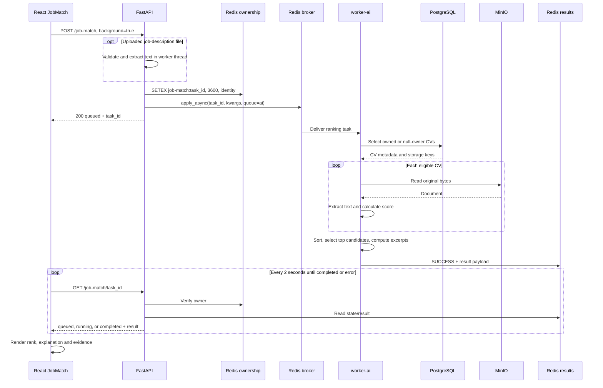
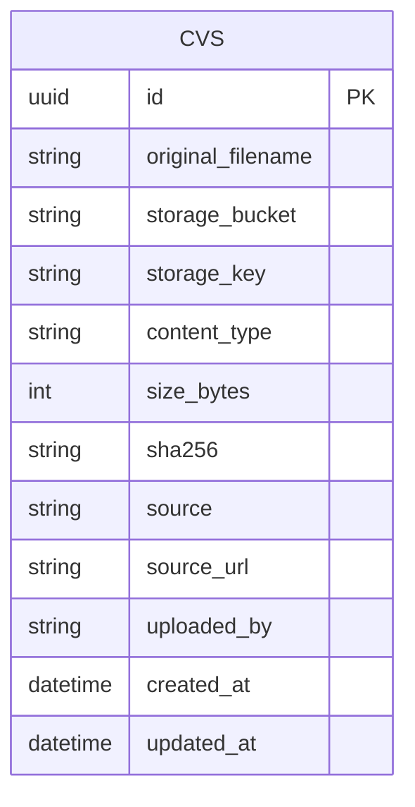
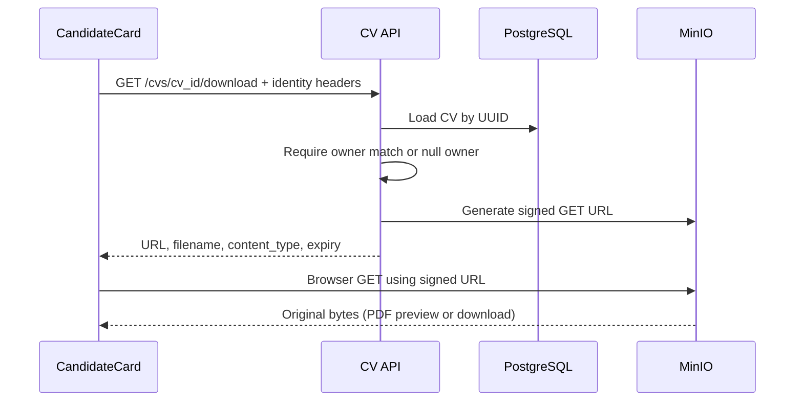

# Job matching: low-level design (LLD)

Status: implemented behavior as of 2026-09-23. Related: [architecture index](ARCHITECTURE.md), [HLD](HLD.md).

Update: [Evidence-based filters](FILTERS.md) supersedes the earlier inactive-filter, unrestricted-limit, score-only ordering and candidate-count descriptions below. Experience is bounded to 0–60 and result limit to 1–200. Qualification checks run before limiting results; group totals cover the full corpus. The original similarity formula is unchanged.

## Module responsibilities

| Module | Main elements |
|---|---|
| `frontend/src/pages/JobMatch.tsx` | `JobMatch`, input mode state, LinkedIn import, `submit`, polling loop, `CandidateCard`, CV preview state |
| `frontend/src/api/client.ts` | API base, identity/key headers, multipart/JSON requests, 120-second abort, `ApiError` |
| `backend/app/api/routers/job_match.py` | `import_linkedin`, `match_job_posting`, `_owners`, `job_match_status` |
| `backend/app/api/routers/cvs.py` | `import_cv`, `list_cvs`, `download_cv`, `delete_cv` |
| `backend/app/workers/tasks/job_match.py` | `rank_job_posting_candidates` Celery task |
| `backend/app/services/linkedin_post.py` | URL normalization, bounded public fetch, HTML/JSON-LD extraction |
| `backend/app/services/validation.py` | Upload byte limits, document validation |
| `backend/app/services/extraction.py` | Digital text extraction and per-page PDF OCR fallback |
| `backend/app/services/similarity.py` | `SimilarityBackend`, `LexicalBackend`, `MiniLmBackend`, backend selection/fallback |
| `backend/app/services/storage.py` | Object writes/reads and signed GET URLs |

## API contracts

Paths below are backend paths. The browser prefixes them with `/api` through nginx. Protected calls carry `X-API-Key` and `X-User-Id` under the configured authentication policy.

| Method and path | Request | Success |
|---|---|---|
| `POST /cvs` | Multipart `file`, optional `source`, `source_url` | `201`, `CVRead` |
| `GET /cvs` | Pagination query | `200`, page of CV metadata |
| `GET /cvs/{cv_id}/download` | UUID path parameter | `200`, signed URL, filename, MIME type and expiry |
| `DELETE /cvs/{cv_id}` | UUID path parameter | `204` |
| `POST /job-match/import-linkedin` | Multipart `url` (maximum 2,048 characters) | `200`, `{text, source_url}` |
| `POST /job-match` | Multipart description and filter fields | `200`, queued task or synchronous result |
| `GET /job-match/{task_id}` | Task ID | `200`, queued/running/completed status |

### Search request

| Field | Type/default | Behavior |
|---|---|---|
| `text` | Optional string | Nonblank job description |
| `file` | Optional uploaded file | Validated and extracted; takes precedence over text |
| `background` | Boolean, `false` | UI sends `true`; returns task ID without waiting for ranking |
| `technologies` | Comma-separated string | Split/trimmed; affects coverage score |
| `age_min`, `age_max` | Optional integers | Accepted, currently not evaluated |
| `min_experience_years` | Optional integer | Accepted, currently not evaluated |
| `certifications`, `education`, `languages` | Comma-separated strings | Accepted, currently not evaluated |
| `limit` | Integer, `20` | Top-result slice size; currently lacks explicit range validation |
| `requirements` | Integer, `15` | Passed as `requirement_limit`; worker currently ignores it |

Missing/blank text with no file returns 400. File validation errors are returned through the shared API error envelope. Upload preparation happens before task publication, including OCR when needed.

```json
{"status": "queued", "task_id": "<uuid>"}
```

### Polling contract

| Celery state | API response |
|---|---|
| `PENDING` and other nonterminal/non-started states | `{"status":"queued"}` |
| `STARTED` | `{"status":"running"}` |
| `SUCCESS` | `{"status":"completed","result":{...}}` |
| `FAILURE`, `REVOKED` | HTTP 503 |
| Wrong owner, unknown/expired ownership key | HTTP 404 |

The endpoint validates ownership before reading `AsyncResult`. An expired/missing Celery result with a still-valid owner key can appear queued; no explicit expiry status is implemented.

## Search sequence



The API generates the task UUID before dispatch. Owner-key creation and broker publication are separate operations, not a transaction. Broker/Redis failures can therefore leave a temporary orphan owner key. Celery tracking is enabled; this task declares `max_retries=0`. Worker acknowledgement/redelivery policy is configured separately in `celery_app.py`.

## CV persistence model



`sha256` and `uploaded_by` are indexed. The hash is not unique; duplicate uploads can coexist. `source_url`, `uploaded_by` and `sha256` are nullable. `source` normally records `upload` or `link`. File bytes live in MinIO, not PostgreSQL. Object keys are generated under the `cvs` prefix using the CV UUID and validated filename.

There are no persistent extracted-text, candidate-profile, search or score rows for this path. Upload stores the object before the database transaction completes; the two stores do not share a transaction.

## Scoring and evidence

### Eligibility

```sql
SELECT * FROM cvs
WHERE uploaded_by = :principal_identity OR uploaded_by IS NULL;
```

All selected CVs are read and extracted on every search. Null-owner rows are shared. A per-document storage/extraction exception is logged and processing continues with empty text for that CV.

### Text similarity

`get_similarity_backend()` selects the configured backend. The default `lexical` implementation normalizes text, removes common stopwords from word tokens, and combines word-token and character 4-gram features. Initial feature weights are 0.65 and 0.35 respectively; feature counts receive logarithmic weighting and vectors are normalized before cosine comparison. These are internal feature weights, not the final technology/text weighting below.

The optional `minilm` implementation uses local ONNX embeddings. Backend initialization failures fall back to lexical. `explanation.method` identifies the actual backend; the top-level `weights.version` is currently hard-coded to `lexical-fallback` and should not be used to infer which backend ran.

### Final score

Let `T` be job/CV text similarity, `N` the number of requested technology entries, and `M` the number found by normalized substring matching in CV text.

```text
No selected technologies: S = T
With technologies:       S = 0.75 × T + 0.25 × (M / N)
```

Example: `T = 0.60`, three of four technologies found:

```text
S = 0.75 × 0.60 + 0.25 × 0.75 = 0.6375 = 63.75 / 100
```

Candidates are sorted by unrounded `S`, descending, then sliced to `limit`. Returned scores are rounded to four decimal places; the current UI rounds the main percentage to an integer. Ties retain the input ordering, which the database query does not explicitly stabilize.

Technology matching is substring-based, not a skill ontology, boundary-aware matcher or synonym resolver. Requested technologies are not inferred from the description. Duplicate input entries are not deduplicated. These factors can affect the coverage component.

Age, experience, education, certifications and languages do not participate. All returned candidates currently have `vetoed=false` and `filtered_out=false`; these flags do not prove that those requirements were checked. `kept_total` is the number returned after the limit, not the eligible corpus size; the latter is `explanation.total_candidates`.

### Supporting excerpts

For each returned candidate, split extracted text into non-overlapping 70-word chunks. Compute job/chunk similarity, sort chunks by that value, and return at most three. Evidence scores are excerpt similarities, not independent contributions to `S`. Excerpts have no page numbers and do not highlight locations inside the PDF.

### Candidate payload (illustrative)

```json
{
  "cv_id": "<uuid>",
  "label": "candidate.pdf",
  "headline": null,
  "score": 0.6375,
  "retrieval_score": 0.6375,
  "matched_technologies": ["Python", "SQL", "Docker"],
  "missing_technologies": ["Kubernetes"],
  "explanation": {
    "rank": 1,
    "total_candidates": 80,
    "text_similarity": 0.6,
    "text_weight": 0.75,
    "technology_coverage": 0.75,
    "technology_weight": 0.25,
    "text_available": true,
    "method": "lexical",
    "evaluated_criteria": ["text_similarity", "technologies"]
  },
  "evidence": [{"passage": "Example excerpt...", "document": "candidate.pdf", "score": 0.72}],
  "vetoed": false,
  "veto_reason": null,
  "filtered_out": false,
  "filtered_reason": null,
  "structured_profile": {
    "age": null, "experience_years": null, "education": null,
    "certifications": [], "languages": [], "skills": []
  }
}
```

`retrieval_score` currently duplicates the final score. The enclosing result contains `status`, `requirements`, `required_technologies`, totals, `filters_applied`, `structured_requirements`, `weights` and `candidates`. `requirements` currently contains only the first 500 characters of job text, not parsed requirements. `filters_applied` echoes requested values even where evaluation is not implemented.

## LinkedIn import

1. Validate HTTPS, host, credentials and port. Accepted input hosts: `linkedin.com`, `www.linkedin.com`, `fr.linkedin.com`; ports: implicit HTTPS or 443.
2. Accept the implemented path patterns: `/jobs/view/{slug}`, `/posts/{slug}`, or `/feed/update/urn:li:activity:{digits}`. Job/post slugs allow ASCII letters, digits, underscores and hyphens.
3. Normalize to `https://www.linkedin.com/{path}/`; discard query/fragment. Do not follow redirects.
4. Fetch with `httpx`, without environment proxies, and require HTTP 200 with HTML content type.
5. Bound the decoded response to 2 MiB. Extract JSON-LD `JobPosting` title/description first, then supported post-content selectors.
6. Return at most 50,000 characters. The UI displays the text in paste mode for editing before search.

HTTP timeout is 15 seconds; the route also wraps the import in a 20-second cancellation scope. Validation, blocked pages, absent content and timeouts produce HTTP 422 with a paste-text fallback message. No authenticated browser session or automatic redirect handling is provided. Parsing depends on the page formats remaining recognizable. Although the API returns `source_url`, the current search UI retains the text only; it does not persist LinkedIn provenance with the search.

## Original CV viewing



Unknown/ineligible CVs return 404. The browser does not send API identity headers to MinIO; the URL signature grants temporary access. The default expiry is 900 seconds. Closing/reopening the card requests a fresh link; no automatic refresh is implemented. PDF content is displayed in an iframe with an open/download fallback. DOCX is downloaded. Signing is for GET; a HEAD request is not a valid substitute when verifying that signed URL.

## Timeouts, limits and failure behavior

| Boundary | Current default / behavior |
|---|---|
| Upload validator | 25 MiB per file |
| Nginx request body | 40 MiB, including multipart overhead |
| Nginx upstream read timeout | 120 seconds |
| Browser individual API request | Aborted after 120 seconds |
| Browser polling interval | 2 seconds after the preceding step completes |
| Browser polling deadline | 20 minutes; not a server-side task cancellation |
| Legacy synchronous wait | 90 seconds |
| Worker soft / hard time limits | 600 / 900 seconds by default |
| Owner mapping TTL | 3,600 seconds |
| Celery result TTL | 86,400 seconds by default |
| CV signed URL TTL | 900 seconds by default |

Configuration/environment overrides can change configurable defaults. Queue wait is additional to task execution time. The UI deadline is checked between polls and is not a precise wall-clock cap when a request itself is waiting. Refreshing loses the task ID in component state; the task can continue on the worker.

Errors from submission/polling clear the UI busy state and render an error. The synchronous API's generic error mentions embeddings/vector services even though the current ranking task does not require Qdrant. A storage/extraction failure for one CV is logged as `job_match.cv_text_unavailable` and does not fail the entire search.

## Complexity and performance

For `N` eligible CVs, each search incurs `N` object reads and extractions, scoring all `N`, and sorting in `O(N log N)`. Returned top candidates incur additional chunk-similarity comparisons for evidence. Extraction/OCR is usually more costly than sorting. The similarity service has an in-process encoding cache, but extracted CV text is not persistently cached. Worker concurrency 1 limits throughput and queues simultaneous searches.

## Tests and verification

| Test file | Coverage |
|---|---|
| [test_job_match_api.py](../../backend/tests/test_job_match_api.py) | Input validation, synchronous/background dispatch, polling states, owner isolation, LinkedIn route, CV link access/missing rows |
| [test_job_match_explanation.py](../../backend/tests/test_job_match_explanation.py) | Score/component consistency, coverage, rank and relevant evidence selection |
| [test_linkedin_post.py](../../backend/tests/test_linkedin_post.py) | URL restrictions, canonicalization, extraction, blocked/redirected/oversized responses |

Run within a Python environment containing the backend and its development dependencies:

```powershell
cd backend
python -m pytest tests/test_job_match_api.py tests/test_job_match_explanation.py tests/test_linkedin_post.py -q
```

Frontend validation:

```powershell
cd frontend
npm run build
```

Manual acceptance: import a PDF, submit a job description with selected technologies, observe polling through completion, compare the explanation with the formula, open the original PDF, and check the fallback when a LinkedIn page is unavailable. Mocked extraction tests verify supported formats; they do not guarantee live LinkedIn availability or real-world ranking quality.
